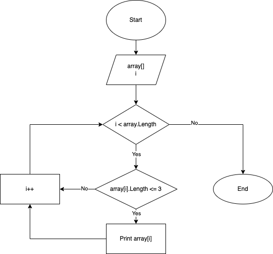

# Описание решения
* Задали массив
* Определили длину массива
* Создали три цикла:
  
  1. *Задавали с клавиатуры элементы массива.* 
  
  2. *Выводили массив.*
  
  3. *Проверяли элементы на условие: еслидлины элемента массива менее или равна трём, то выводили этот элемент.*